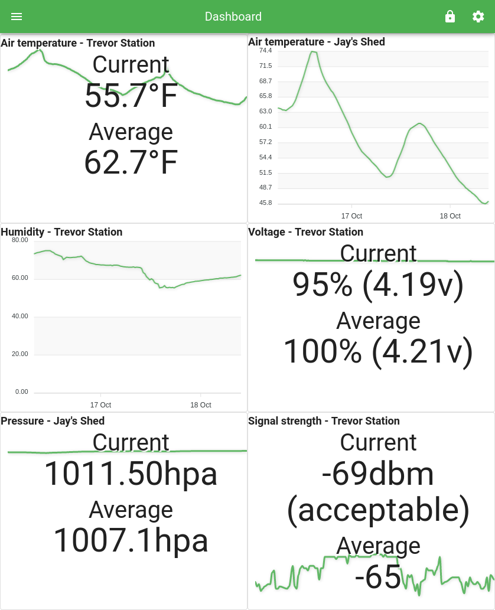

This is a [monorepo](https://en.wikipedia.org/wiki/Monorepo) with all the instructions and software to build and program your own solar-powered wi-fi weather station(s).

- [Overview](#overview)
- [Building the weather stations](hardware-files/README.md)
- [Arduino sketch README](sketch/README.md)
- [API server README](api-server/README.md)
- [Web app README](web-app/README.md)

| | |
|:-------------------------:|:-------------------------:|
|  |  |
|  |  |

## Overview

The weather stations send measurements to the API server to collect, which in turn serves this data to the web app (PWA) that users load on their computer or mobile device.

<!-- (Flowchart generated using [gojs](https://gojs.net/latest/samples/flowchart.html). Load `diagram.json` onto their site to generate a new svg.) -->

**Folder structure:**

- **[api-server/](api-server/)** - API server
- **[hardware-files/](hardware-files/)** - All the files needed to print and build the weather station hardware
- **[sketch/](sketch/)** - Embedded software that runs on the weather stations
- **[web-app/](web-app/)** - Website/mobile app
