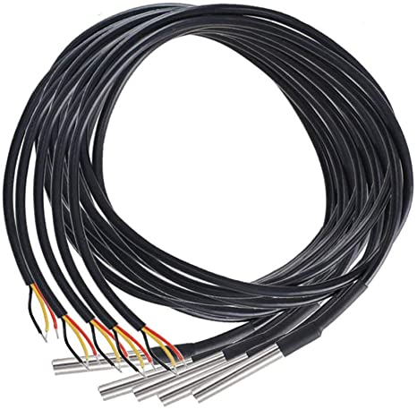
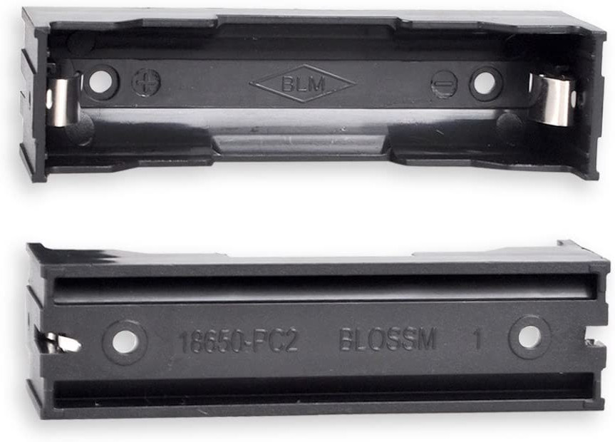
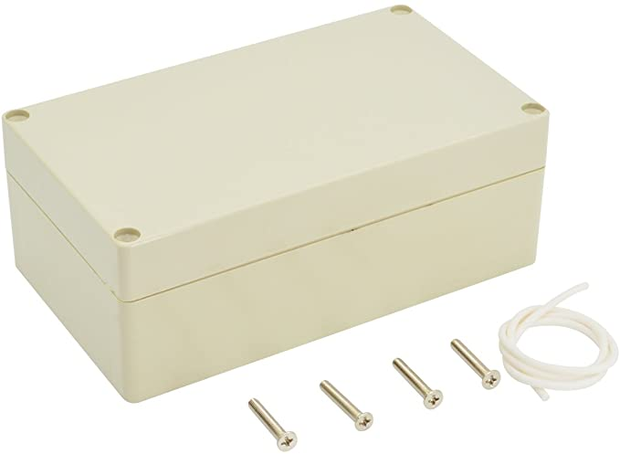

# Hardware build instructions

- [Overview](#overview)
- [Bill of materials](#bill-of-materials)

## Overview

- PCB Gerber Zip - [Download](W155288ASM1_Gerber_Solar_Powered_WiFi_Weather_Station_V2.0.zip)

The hardware used for this project originally comes from [instructables.com](https://www.instructables.com/id/Solar-Powered-WiFi-Weather-Station-V20/). This folder contains the PCB (printed circuit board) design that you will need to send off to a PCB printing/milling service. This has been printed with JLCPCB but any printing service should do as the board is relatively simple. For component assembly instructions, follow the instructables link.

Furthermore, the [Stevenson screen enclosure](https://www.thingiverse.com/thing:3615016) can be 3D printed, however the design isn't well optimized and instead for this project we opted to use injection-molded junction boxes to house the PCB and solar panel.

## Bill of materials

- **qty 1** ESP8266 Wemos D1 Mini + Antenna ([Ebay](https://www.ebay.com/itm/132599080356))
- **qty 1** 6-pin BME280 ([Amazon](https://www.amazon.com/HiLetgo-Atmospheric-Pressure-Temperature-Humidity/dp/B01N47LZ4P))
- **qty 1** DS18B20 water sensor (optional)
  - 4.7k ohm resistor to connect DS18B20

- **qty 1** 18650 battery, flat top style ([18650 Battery Store](https://www.18650batterystore.com/collections/sanyo-18650-batteries/products/sanyo-bl))
- **qty 1** 18650 battery holder ([Amazon](https://www.amazon.com/gp/product/B07D1FRL54))

- **qty 1** 220K ohm resistor ([Digikey](https://www.digikey.com/product-detail/en/stackpole-electronics-inc/CF12JT220K/CF12JT220KCT-ND/1830532))
- **qty 1** Header jumper ([Digikey](https://www.digikey.com/product-detail/en/harwin-inc/M7582-05/952-2881-ND/3922850))
- **qty 1** Header pins (for jumper) ([Digikey](https://www.digikey.com/product-detail/en/sullins-connector-solutions/PRPC040SAAN-RC/S1011EC-40-ND/2775214))
- **qty 1** Slide switch ([Digikey](https://www.digikey.com/product-detail/en/c-k/SS-12D07-VG-4-NS-GA-PA/CKN10397-ND/2747177))
- **qty 1** Terminal block 5mm-pitch, 2-pos ([Digikey](https://www.digikey.com/product-detail/en/w-rth-elektronik/691137710002/732-10955-ND/6644051))
- Connectors (if you don't want to solder sensors directly to the board)
  - **qty 1** JST EH series terminal, 6-pos ([Digikey](https://www.digikey.com/short/7r8qw4pc))
  - **qty 3** JST EH series terminal, 4-pos ([Digikey](https://www.digikey.com/short/vwfc4n4v))
  - **qty 2** JST EH series terminal, 3-pos ([Digikey](https://www.digikey.com/short/32btm383))
  - **qty 1** JST EH series connector housing, 6-pos ([Digikey](https://www.digikey.com/product-detail/en/jst-sales-america-inc/EHR-6/455-1004-ND/527228))
  - **qty 3** JST EH series connector housing, 4-pos ([Digikey](https://www.digikey.com/product-detail/en/jst-sales-america-inc/EHR-4/455-1002-ND/527226))
  - **qty 2** JST EH series connector housing, 3-pos ([Digikey](https://www.digikey.com/product-detail/en/jst-sales-america-inc/EHR-3/455-1001-ND/527225))
  - **qty 24** JST EH series crimp pins ([Digikey](https://www.digikey.com/product-detail/en/jst-sales-america-inc/SEH-001T-P0.6/455-1042-1-ND/527266))
- **qty 1** Enclosure (if you aren't 3D printing your own) - "LeMotech" Waterproof Enclosure ([Amazon](https://www.amazon.com/LeMotech-Waterproof-Dustproof-Universal-Enclosure/dp/B075X17M4T))

- **qty 1** 110mmx80mm 5v solar panel ([Amazon](https://www.amazon.com/gp/product/B08KCWDWY9))
